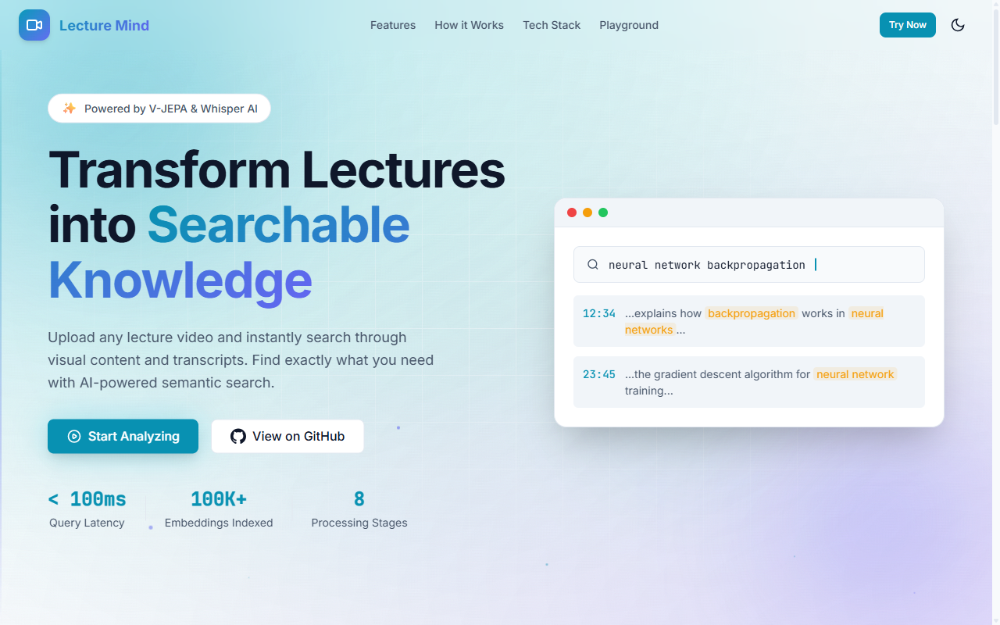
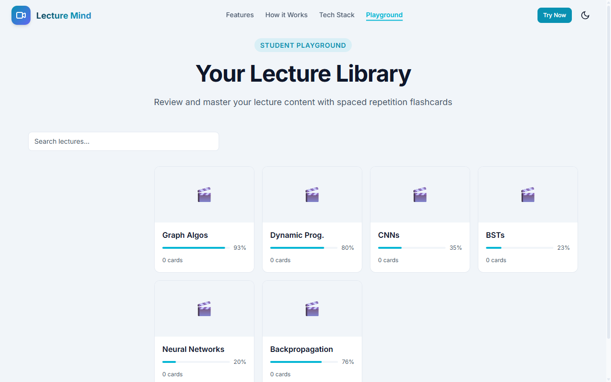
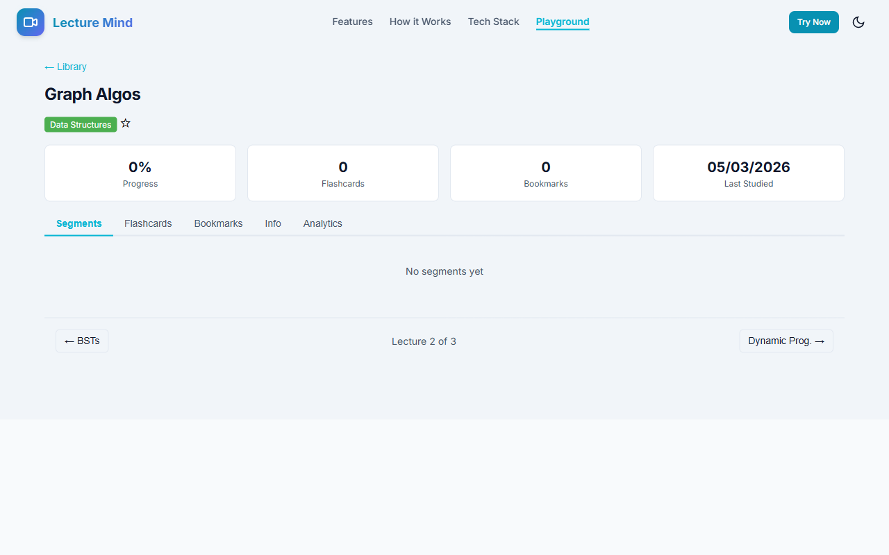
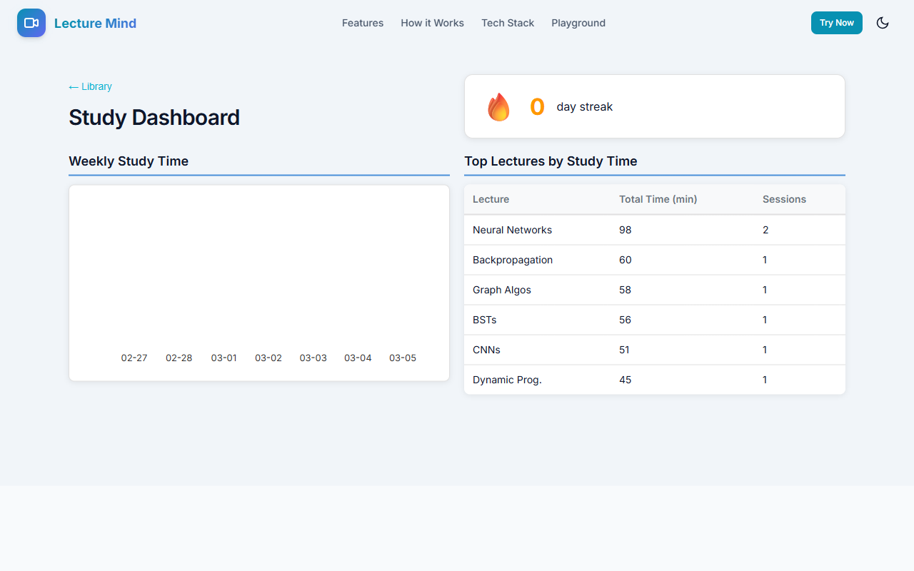

# Lecture Mind

[](https://github.com/matte1782/lecture-mind/actions/workflows/ci.yml)
[](https://www.python.org/downloads/)
[](https://opensource.org/licenses/MIT)
[](https://github.com/matte1782/lecture-mind)
[](https://github.com/matte1782/lecture-mind)

**Transform lecture videos into searchable, study-ready knowledge.** Lecture Mind combines DINOv2 visual encoding, Whisper transcription, and spaced-repetition flashcards into one tool — so you spend less time rewinding and more time learning.

<p align="center">
  
</p>

---

## Try It Now

| Option | What You Get | Link |
|--------|--------------|------|
| **Student Playground** | Flashcards, library, analytics — runs in your browser, no install | [Open Playground](https://matte1782.github.io/lecture-mind/playground/) |
| **Cloud Demo** | Upload a video, search visually + by transcript | [lecture-mind.onrender.com](https://lecture-mind.onrender.com) |
| **Local Install** | Full AI pipeline on your machine (GPU recommended) | [Setup Guide](docs/local-setup.md) |

> The cloud demo uses placeholder processing. For real AI models, install locally.

---

## Student Playground (v0.4.0)

The Playground is a **local-first learning environment** that runs entirely in your browser. No server, no account, no data leaves your machine.

### Lecture Library

Organize lectures into courses, sort by date/title/progress, search across all transcripts, and switch between grid and list views.

<p align="center">
  
</p>

**What you can do:**
- Create courses and color-code them
- Import processing results (drag & drop JSON)
- Batch-select lectures for course assignment or deletion
- Full-text search across all lecture transcripts
- Filter by course, favorites, or "All Lectures"

### Lecture Detail

Click any lecture to see segments, flashcards, bookmarks, and per-lecture analytics — all in a tabbed interface with playlist navigation between lectures.

<p align="center">
  
</p>

**What you can do:**
- Browse segments with timestamps
- Create and review flashcards (auto-generated or manual)
- Add bookmarks to key moments
- View per-lecture analytics (accuracy trends, mastery distribution)
- Navigate between lectures with Previous/Next

### Flashcard Study Sessions

Start a study session from any lecture. Cards use the **SM-2 spaced repetition algorithm** — rate each card (Again/Hard/Good/Easy) and the system schedules optimal review intervals.

**How it works:**
1. Open a lecture → **Flashcards** tab → **Start Study Session**
2. See the question, flip to reveal the answer
3. Rate your recall: `1` Again, `2` Hard, `3` Good, `4` Easy
4. Cards are rescheduled based on your ratings — mastered cards appear less often

### Study Dashboard

Track your progress across all lectures with streak tracking, weekly study time charts, and a leaderboard of your most-studied lectures.

<p align="center">
  
</p>

### Keyboard Shortcuts

| Key | Action |
|-----|--------|
| `?` | Show keyboard shortcuts |
| `/` | Focus search bar |
| `Escape` | Close dialogs / clear search |
| `Enter` | Open selected lecture |
| Arrow keys | Navigate library grid |
| `1`-`4` | Rate flashcard during study |

### Offline Support

A Service Worker caches all static assets on first load. Once loaded, the playground works **fully offline** — browse lectures, study flashcards, view analytics, all without network.

---

## AI Pipeline Features

The backend processes lecture videos through an 8-stage pipeline:

- **Visual Encoding**: DINOv2 ViT-L/16 for 768-dim frame embeddings
- **Text Encoding**: sentence-transformers (all-MiniLM-L6-v2) for query embeddings
- **Audio Transcription**: Whisper integration for lecture transcription
- **Multimodal Search**: Combined visual + transcript ranking with configurable weights
- **Event Detection**: Automatic slide transition and scene change detection
- **FAISS Index**: Fast similarity search with IVF optimization for large collections

### Performance

| Operation | Target | Actual |
|-----------|--------|--------|
| Query latency (1k vectors) | <100ms | 30.6us |
| Search latency (100k vectors) | <100ms | 106.4us |
| Frame embedding (placeholder) | <50ms | 0.36ms |
| Event detection | <10ms | 0.24ms |

---

## Installation

### Quick Start (pip)

```bash
# Basic (CPU)
pip install lecture-mind

# With ML models (GPU recommended)
pip install lecture-mind[ml]

# With audio transcription
pip install lecture-mind[audio]

# Everything
pip install lecture-mind[all]
```

### Development Setup

```bash
git clone https://github.com/matte1782/lecture-mind.git
cd lecture-mind
pip install -e ".[dev,ml,audio]"
```

## Usage

### CLI

```bash
# Process a lecture video
lecture-mind process lecture.mp4 --output data/

# Query the processed lecture
lecture-mind query data/ "What is gradient descent?"

# List detected events
lecture-mind events data/
```

### Python API

```python
from vl_jepa import (
    VideoInput, FrameSampler,
    TextEncoder, MultimodalIndex,
)
from vl_jepa.encoders import PlaceholderVisualEncoder

with VideoInput.from_file("lecture.mp4") as video:
    frames = FrameSampler(fps=1.0).sample(video)

encoder = PlaceholderVisualEncoder()
embeddings = encoder.encode_batch(frames)

index = MultimodalIndex()
index.add_visual(embeddings, timestamps=[f.timestamp for f in frames])

results = index.search(TextEncoder.load().encode("machine learning basics"), k=5)
for r in results:
    print(f"{r.timestamp:.1f}s — score {r.score:.3f}")
```

### Student Playground (local)

```bash
# Start the dev server
python -m vl_jepa.api

# Open in browser
# http://127.0.0.1:8000/static/index.html#/playground
```

---

## Architecture

```
lecture.mp4
    |
    v
+-------------+     +-------------+     +-----------+
| VideoInput  |---->|FrameSampler |---->|  Frames   |
+-------------+     +-------------+     +-----------+
                                              |
                    +-------------------------+-------------------------+
                    v                         v                         v
            +-------------+           +-------------+           +-------------+
            |VisualEncoder|           |EventDetector|           |AudioExtract |
            |  (DINOv2)   |           |             |           |  (FFmpeg)   |
            +-------------+           +-------------+           +-------------+
                    |                         |                         |
                    v                         v                         v
            +-------------+           +-------------+           +-------------+
            | Embeddings  |           |   Events    |           | Transcriber |
            |  (768-dim)  |           |             |           |  (Whisper)  |
            +-------------+           +-------------+           +-------------+
                    |                         |                         |
                    +-------------------------+-------------------------+
                                              v
                                   +-----------------+
                                   | MultimodalIndex |
                                   |     (FAISS)     |
                                   +-----------------+
                                              |
                              +---------------+---------------+
                              v                               v
                    +-----------------+             +-----------------+
                    |  Search/Query   |             |   Playground    |
                    |   (CLI/API)     |             | (Browser Study) |
                    +-----------------+             +-----------------+
```

---

## Tech Stack

| Component | Technology |
|-----------|------------|
| Language | Python 3.10+ |
| ML Framework | PyTorch |
| Visual Encoder | DINOv2 ViT-L/16 |
| Text Encoder | all-MiniLM-L6-v2 |
| Transcription | Whisper |
| Vector Search | FAISS |
| Backend | FastAPI |
| Frontend | Vanilla JS (ES modules), IndexedDB |
| Tests | pytest (backend), Jest + jsdom (frontend) |
| Deployment | GitHub Pages (playground), Render (API) |

## Development

```bash
# Backend tests
pytest tests/ -v

# Frontend tests (557 tests across 10 suites)
cd src/vl_jepa/api/static
node --experimental-vm-modules node_modules/jest/bin/jest.js

# Lint and format
ruff check src/ && ruff format src/

# Type check
mypy src/ --strict
```

## Roadmap

- [x] **v0.1.0** — Foundation (placeholder encoders, basic pipeline)
- [x] **v0.2.0** — Real Models + Audio (DINOv2, Whisper, multimodal search)
- [x] **v0.3.0** — Web UI + Cloud Demo (FastAPI, Docker, security hardening)
- [x] **v0.4.0** — Student Playground (flashcards, library, analytics, offline)
- [ ] **v0.5.0** — Professor Edition (confusion analytics, class-wide dashboard)
- [ ] **v1.0.0** — Production (optimization, real decoder, deployment)

## License

MIT License — see [LICENSE](LICENSE) for details.

## Citation

```bibtex
@software{lecture_mind,
  title = {Lecture Mind: Event-aware Lecture Summarizer},
  author = {Matteo Panzeri},
  year = {2026},
  url = {https://github.com/matte1782/lecture-mind}
}
```
